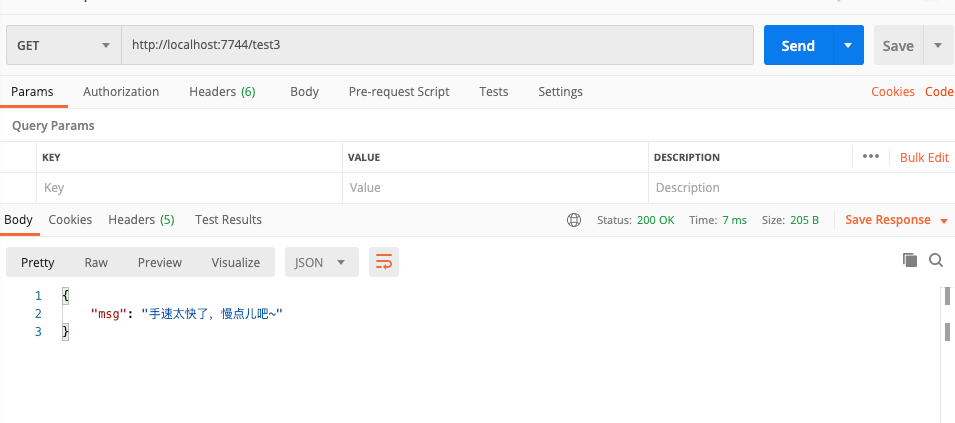

# spring-boot-redis-ratelimit-demo

>此 demo 主要演示了 Spring Boot 项目如何通过 AOP 结合 Redis + Lua 脚本实现分布式限流，旨在保护 API 被恶意频繁访问的问题

代码见项目

1、调用`http://localhost:7744/test3`接口


2、快速刷新后

同时在控制台显示 **接口访问达到上限**
```java
2020-07-03 14:50:12.135  INFO 39283 --- [nio-7744-exec-7] c.s.s.r.r.aspect.RateLimiterAspect       : 【limit:测试自定义key:0:0:0:0:0:0:0:1】在单位时间 60000 毫秒内访问 1 次
2020-07-03 14:50:12.135  INFO 39283 --- [nio-7744-exec-7] c.s.s.r.r.c.RateLimitTestController      : 【test3】被执行了。。。。。
2020-07-03 14:50:13.225  INFO 39283 --- [nio-7744-exec-8] c.s.s.r.r.aspect.RateLimiterAspect       : 【limit:测试自定义key:0:0:0:0:0:0:0:1】在单位时间 60000 毫秒内访问 2 次
2020-07-03 14:50:13.225  INFO 39283 --- [nio-7744-exec-8] c.s.s.r.r.c.RateLimitTestController      : 【test3】被执行了。。。。。
2020-07-03 14:50:13.876 ERROR 39283 --- [nio-7744-exec-9] c.s.s.r.r.aspect.RateLimiterAspect       : 【limit:测试自定义key:0:0:0:0:0:0:0:1】在单位时间 60000 毫秒内已达到访问上限，当前接口上限 2
2020-07-03 14:50:14.744 ERROR 39283 --- [io-7744-exec-10] c.s.s.r.r.aspect.RateLimiterAspect       : 【limit:测试自定义key:0:0:0:0:0:0:0:1】在单位时间 60000 毫秒内已达到访问上限，当前接口上限 2
```
3、在redis desktop manager上查看，redis中保存的值


mac版RDM安装见：
[mac安装Redis可视化工具-Redis Desktop Manager](https://blog.csdn.net/qq_37866486/article/details/90749179)

代码参考：
[spring-boot-demo-ratelimit-redis](https://github.com/xkcoding/spring-boot-demo/tree/master/spring-clould-demo-ratelimit-redis)
