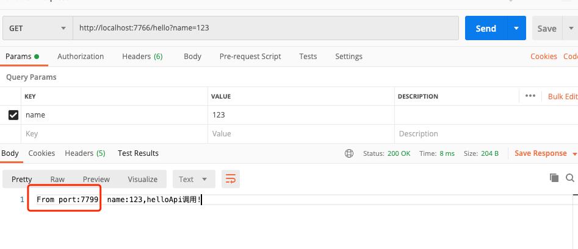

# Ribbon的使用


ribbon默认使用轮询的调用机制

## 项目启动
### 1、在本地启动两个eureka-client


### 2、启动ribbon客户端


### 3、第一次调用接口
 `http://localhost:7766/hello?name=123` 
返回的结果看到调用到的端口是7799


### 4、第二次调用接口
 `http://localhost:7766/hello?name=123` 
返回的结果看到调用到的端口是7798


### 5、使用随机负载均衡策略
可以在Application的启动类中加入
```$xslt
@Bean
	public IRule ribbonRule() {
		return new RandomRule();
	}
```
在调用`http://localhost:7766/hello?name=123` 接口的时候会随机取得`eureka-client`的服务地址