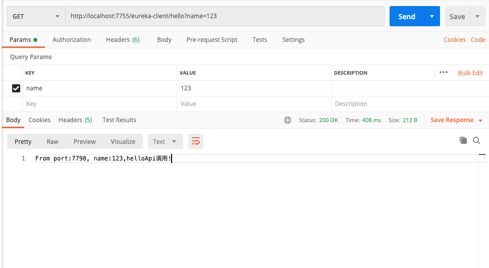

# Spring Cloud ZUUl

## 使用Zuul步骤
1、引入Zuul依赖，并且让Zuul注册到eureka上
```aidl
        <dependency>
            <groupId>org.springframework.cloud</groupId>
            <artifactId>spring-cloud-starter-netflix-zuul</artifactId>
        </dependency>
```

2、在启动类上加上`@EnableZuulProxy`，`@EnableDiscoveryClient`注解
```aidl
@Slf4j
@EnableZuulProxy
@EnableDiscoveryClient
@SpringBootApplication
public class SpringBootZuulDemoApplication
{

	public static void main(String[] args)
	{
		SpringApplication.run(SpringBootZuulDemoApplication.class, args);
		log.info("SpringBootZuulDemo 启动了-------------");
	}

}
```

3、在配置文件中添加zuul配置
表示当访问地址符合`/hello/**`的时候，会自动定位到`eureka-client`服务上去。
```aidl
zuul:
  routes:
    eureka-client:
      path: /hello/**
      serviceId: eureka-client
```
这里可以简化成
```aidl
zuul:
  routes:
    eureka-client: /hello/**
```

4、启动`gateway-zuul`项目，调用`http://localhost:7755/eureka-client/hello?name=123`

显示调用成功